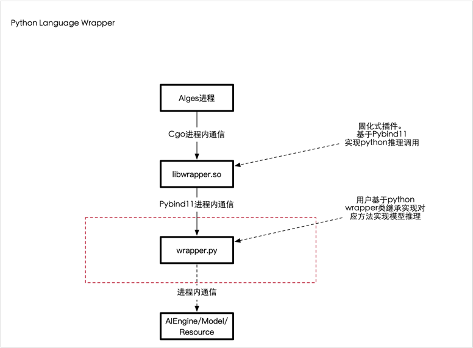

# 背景

还在想如何偷懒，直接复用研究员的Python代码进行在线推理？

还在寻找模型推理RPC->HTTP方案？

还在找 C/C++ 调用 Python, Python调用 C/C++技术方案？


还在找如何提速Python方案？

....

## 你在找的这里都有

当前算法开发主流语言都是Python语言， 而想要落地成为生产级别服务应用，往往需要用C/C++等高阶语言进行复现并封装成高性能接口。

但是并非所有的场景都是需要高性能，任何服务接口的高性能的优化都是循序渐进的，目前很多厂商都会选择用Python进行实际推理， 讯飞当前拥有

一套Golang加载C插件方案，来支持当前讯飞主要的一些AI线上生产级别服务应用。

为了让用户更快速的接入Python实现的能力， 在当前讯飞AIGES架构基础上，利用Pybind11兼容了支持Python AI能力服务化。

## Go/C、C++架构


## 支持wrapper.py Go/C/Python 架构
Python Language Wrapper:


讯飞开源出品的 AthenaServing是一个将 Python AI能力(也可以支持C/C++)发布成为HTTP服务的 AI工程框架，详情请参考: [Github](https://github.com/xfyun/aiges)

## C调用Python

由上述架构可知， 我们需要使用C++调用Python能力(Golang无法直接调用Python,我们技术栈是Golang)。

### Python原生方案
传统的C调用Python，大多数人都会使用原生的Cpython形式去调用Python，我们在[第一个版本](https://github.com/xfyun/aiges_c_python_wrapper/blob/release-v1.0.0/pyCall_common.cpp)时也是如此,其复杂度不言而喻，设计到Python的生命周期管理，内存管理，GIL，引用计数，对象转换等等...


Python 官方提供了 Python/C API，可以实现「用 C 语言编写 Python 库」，先上一段代码感受一下：

```c++
static PyObject *
spam_system(PyObject *self, PyObject *args)
{
    const char *command;
    int sts;

    if (!PyArg_ParseTuple(args, "s", &command))
        return NULL;
    sts = system(command);
    return PyLong_FromLong(sts);
}
```

上述是一个简单的对python system命令进行调用，却要进行多次手动类型转换，十分痛苦。。


### Cython方案

Cython 主要打通的是 Python 和 C，方便为 Python 编写 C 扩展。Cython 的编译器支持转化 Python 代码为 C 代码，这些 C 代码可以调用 Python/C 的 API。从本质上来说，Cython 就是包含 C 数据类型的 Python。目前 Python 的 numpy，以及腾讯的 tRPC-Python 框架有所应用。

缺点：
需要手动植入 Cython 自带语法（cdef 等），移植和复用成本高
需要增加其他文件，如 setup.py、*.pyx 来让你的 Python 代码最后能够转成性能较高的 C 代码
对于 C++的支持程度存疑


### SWIG
SWIG 主要解决其他高级语言与 C 和 C++语言交互的问题，支持十几种编程语言，包括常见的 java、C#、javascript、Python 等。使用时需要用*.i 文件定义接口，然后用工具生成跨语言交互代码。但由于支持的语言众多，因此在 Python 端性能表现不是太好。

值得一提的是，TensorFlow 早期也是使用 SWIG 来封装 Python 接口，正式由于 SIWG 存在性能不够好、构建复杂、绑定代码晦涩难读等问题，TensorFlow 已于 2019 年将 SIWG 切换为 [pybind11](#PYBIND11)。


### PYBIND11

在pybind11 之前其实有一个boost.python库也是经典，但是它比较重度依赖 boost周边依赖库，比较庞大，经常让人望而却步.

pybind11 可以理解为boost.python的精简版，通过提供头文件，宏定义和元编程来简化 Python 的 API 调用。对 C++支持非常好，基于 C++11 应用了各种新特性，也许 pybind11 的后缀 11 就是出于这个原因。

特点：

* 轻量且功能单一，聚焦于提供 C++ & Python binding，交互代码简洁
* 对常见的 C++数据类型如 STL、Python 库如 numpy 等兼容很好，无人工转换成本
* only header 方式，无需额外代码生成，编译期即可完成绑定关系建立，减小 binary 大小
* 支持 C++新特性，对 C++的重载、继承，debug 方式便捷易用
* 完善的官方[文档](https://pybind11.readthedocs.io/)支持，应用于多个知名开源项目

## C++与python共舞，c++ python互调用

* AIGes中C++结合Pybind11调用Python 

如[上述](#支持wrapperpy-gocpython-架构)所示,我们为用户设计了class Wrapper类，用户需要实现Wrapper类中的必要方法，然后由C++读取该类并加载对应方法，当用户请求到达时，执行对应python方法，并返回得到相应数据完成一次推理请求。

* C中传入数据到 wrapperOnceExec,python如何接受？

我们重点看下 `Wrapper` 类的关键推理方法 `wrapperOnceExec` 方法, 该方
法函数定义为:

```python

def wrapperOnceExec(self, params: {}, reqData: DataListCls) -> Response:
    pass
```

其中 `params` 为该请求中的params请求参数映射，是一个字典，主要用于传递用户一些请求控制字段。

 `reqData` 为该次请求的一些数据段，比如上传一个二进制图像，音频，文本等(此类参数不适合放入params中)，reqData我们要求它必须是1个`DataListCls`类. 这个类有些特殊，因为我们的数据是来源于 C++,即从C++中传入数据到Python，因此这个请求必须在 c++侧构造，那么此处就涉及到 C++数据和Python数据的转换问题。

 Pybind11提供了在C中定义内嵌(embed)python模块方式: 因此我们可以在C中给python很容易定义一个数据结构，比如此处:

```c++
class DataListNode {
public:
    std::string key;
    py::bytes data;
    unsigned int len;
    int type;

    py::bytes get_data();
};

class DataListCls {
public:
    std::vector <DataListNode> list;

    DataListNode *get(std::string key);
};

DataListNode *DataListCls::get(std::string key) {
    for (int idx = 0; idx < list.size(); idx++) {
        DataListNode *node = &list[idx];
        if (strcmp(node->key.c_str(), key.c_str()) == 0) {
            return node;
        }
    }
    return nullptr;
}
```

在c++中定义了两个类结构， 一个是 `DataListCls` 另一个是 `DataListNode`, 后者是前者的 `list` 变量成员。
我们的请求数据可以用 `DataListCls` 表示，那么该类数据传递到python函数如何被执行？

根据pybind11手册， 我们需要为上述2个类编写binding代码，如下:

```c++
PYBIND11_EMBEDDED_MODULE(aiges_embed, module
) {
    py::class_<DataListNode> dataListNode(module, "DataListNode");
    dataListNode.

                    def(py::init<>())

            .def_readwrite("key", &DataListNode::key, py::return_value_policy::automatic_reference)
            .def_readwrite("data", &DataListNode::data, py::return_value_policy::automatic_reference)
            .def_readwrite("len", &DataListNode::len, py::return_value_policy::automatic_reference)
            .def_readwrite("type", &DataListNode::type, py::return_value_policy::automatic_reference)
            .def("get_data", &DataListNode::get_data, py::return_value_policy::reference);

    py::class_<DataListCls> dataListCls(module, "DataListCls");
    dataListCls.

                    def(py::init<>())

            .def_readwrite("list", &DataListCls::list, py::return_value_policy::automatic_reference)
            .def("get", &DataListCls::get, py::return_value_policy::reference);
}
```

`PYBIND11_EMBEDDED_MODULE`(aiges_embed, module) 宏用于定义一个 python的 aiges_embed模块，其内容为两个类的各个成员做了一个与python对应类的绑定动作：

其中使用 `def_readwrite`绑定可读写属性，使其与对应C类中成员变量。

其中使用 `def`绑定类方法，使其与对应C类中方法(有点类似于用c实现一套方法供用户在python中调用)，上述 wrapperOnceExec方法在c++侧调用后， 执行到 python代码时， 如果执行 reqData.get方法，即会调用c++实现的get方法。

因为C++和python有不同的内存管理机制， 在为返回非普通类型的函数创建绑定时，这可能会导致问题。仅通过查看类型信息， Python侧不知道是否应该负责返回值并最终释放其资源，或者是否应该在 C++ 端处理内存的释放。为此，pybind11 提供了几个返回值策略 注解，可以传递给module_::def()and class_::def()函数。默认策略是 
`return_value_policy::automatic`。

这块在绑定function时需要特别注意， 不合适的返回值策略可能会引发未知错误，因此此部分非常极其重要。

关于返回值策略，请参考[文档](https://pybind11.readthedocs.io/en/stable/advanced/functions.html)


有了以上的binding之后， 在对应的python解释器生命周期中，可以直接使用  `import aiges_embed` 导入该c侧定义的Module以及其中的class类。

[wrapper.py](https://github.com/xfyun/aiges_c_python_wrapper/blob/master/wrapper.py)向您展示了导入 python侧的实现。

需要注意的是：

aiges_embed 库是用宏`PYBIND11_EMBEDDED_MODULE`在c侧进程中动态定义，因此aiges_embed库无法在本地的python lib目录中找到，这给我们本地调试带来一定的困难，即用户不清楚aige_embed中的DataListNode, DataListCls是如何实现，以及定义的。

因此，`aiges`这边做法是创建一个python的 [sdk](https://github.com/xfyun/aiges_python)，供用户在使用Pure Python(没有c程序运行环境，只有python)环境调试`wrapper.py`逻辑.
我们在 [sdk.dto](https://github.com/xfyun/aiges_python/blob/master/aiges/dto.py#L51)实现c侧定义的相同类，所以你可以看到 wrapper.py的前两行:

```python
try:
    from aiges_embed import ResponseData, Response, DataListNode, DataListCls  # c++
except:
    from aiges.dto import Response, ResponseData, DataListNode, DataListCls

```
第一行导入执行成功的条件是,由c进程加载运行此wrapper.py

第二行导入执行成功的条件是,本地python环境模拟运行 wrapper.py时，此时依赖本地python库是否 安装过aiges依赖

使用 `pip install aiges` 即可完成安装。


***注意*** 

肯定有同学比较疑惑这个设计。 这个问题，我没有发现pybind11原生有何更优的解决方案，如有我不知道的，还请各位观众告知。


* Python执行完 wrapperOnceExec,C++如何接受python返回？

上述描述了C++传入数据到Python，用的是 `DataListCls`类的绑定， 返回其实也类似，也是实现类似绑定 `Response`
参见:

[pywraper.h](https://github.com/xfyun/aiges_c_python_wrapper/blob/master/pyWrapper.h#L40)


### aiges sdk

上述提到的在python的 [aiges sdk](https://github.com/xfyun/aiges_python/blob/master/aiges/sdk.py#L714)中， 我们用python实现了对C程序的一个仿真，并且，在sdk中检查用户对 wrapper.py的编写是否有纰漏或者错误，提前暴露wrapper.py可能的编写问题。

wrapper.py的编写请移步: [实现第一个wrapper.py](https://xfyun.github.io/athena_website/docs/%E5%8A%A0%E8%BD%BD%E5%99%A8/Python%E6%8F%92%E4%BB%B6)


### 关于python插件性能
一句话，当前状态未正式测试python性能，引用前同事一句话(你都开始用py了还考虑性能？？？)等下，这并不严谨，我道歉。python也是可以实现比较高的性能的， 且听我一段不负责任的嘴遁分析：

1: 当前主流的python推理实现，最终计算部分还是落在了python中的一些三方科学库中，如numpy，tensorflow等 c实现的类库中。 因此，比较负责任的一段解释是，如果你的推理插件中纯python的逻辑越少，那么理论上性能不会下降太多。一旦有一些复杂逻辑在python中用纯py实现，那么该处一定是一个性能下降点。

2: 如果ai能力要求输入一些大的二进制，比如图片，音视频，从C的内存到 Python的 bytes内存需要有一次拷贝，可能是一个性能下降点

3: 多说无益，具体情况具体分析


### 关于pybind11 提供的拷贝机制

Python提供了一套 [Buffer Protocol](https://docs.python.org/3/c-api/buffer.html)，基于它可以实现内存0拷贝，在不同的C插件中进行转移处理。

简而言之呢它是个什么玩意呢？ 比如有一个大段的数据快(音视频)，比如将它放在一个 array数组中，闲着我们需要用 numpy去加载它，如果这个array数组是原生的python list，那么这一过程必然是有拷贝过程的。但是如果设计了在c中利用buffer protocol设计出一个数据结构，这个数据结构传递到 numpy处理时，数据块可以直接指针转移，无需做数据拷贝，即可在numpy中处理该数据内存大块， 这在计算推理场景十分有用。

具体0拷贝以及 buffer protocol 的demo参考:

- [简易的 buffer protocol demo](https://jakevdp.github.io/blog/2014/05/05/introduction-to-the-python-buffer-protocol/#:~:text=The%20Python%20buffer%20protocol%2C%20also,manipulate%20large%20arrays%20of%20data.)

- [pybind11: buffer protocol](https://pybind11.readthedocs.io/en/stable/advanced/pycpp/numpy.html?highlight=numpy#)


### 总结

利用Python pybind11 我们可以用非常简洁的代码实现 C和python的互调用，这给我们AI工程化提供了更多的可能性。

### 特别鸣谢

本文部分参考(chao): 

- https://zhuanlan.zhihu.com/p/444805518