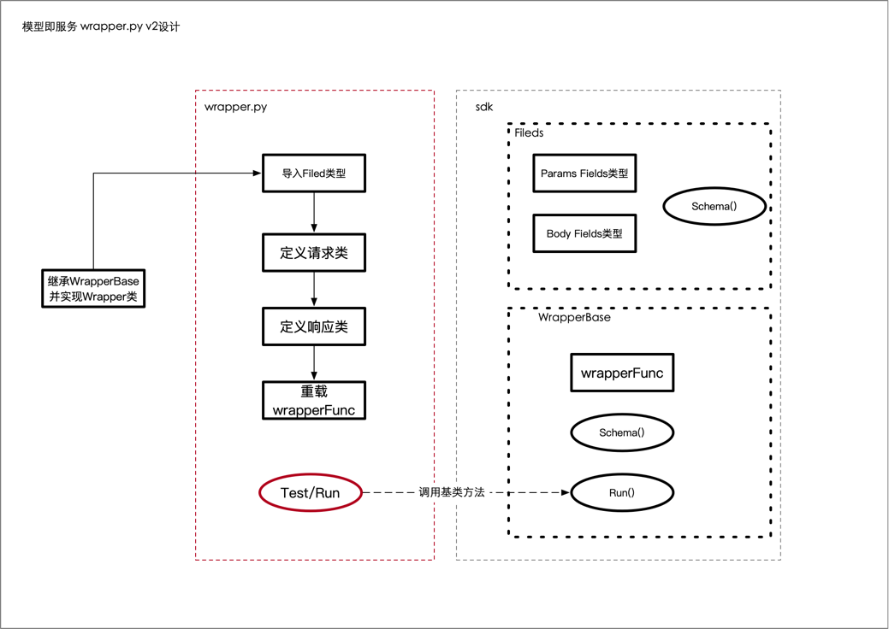

# V2-New Design of wrapper.py设计(进行中)

## wrapper.py 架构

Python Language Wrapper:


## 背景

1. 当前的wrapper.py 由[C项目](https://github.com/xfyun/aiges_c_python_wrapper)
   实现了 [wrapper接口](https://github.com/xfyun/aiges_c_python_wrapper/blob/master/include/aiges/wrapper.h)实现。
   aiges_c_python_wrapper编译成 libwrapper.so，由aiges统一加载。
2. 当前如果python用户需要实现推理插件， 只需要参考 [wrapper.py](https://github.com/xfyun/aiges_c_python_wrapper/blob/master/wrapper.py)
   实现对应接口后，即可实现python推理。
3. 当前用户实现 wrapper.py后， 无法直接调试运行，且不太了解 aiges如何调用 wrapper.py 以及传递到 wrapper.py
   对应的参数是什么类型都非常疑惑，造成python版本的AI推理插件集成方式并不那么pythonic。

## 新版wrapper.py集成方式优化目标

1. 用户可以定义AI能力输入的数据字段，控制字段列表
2. 用户可以按需定义AI能力输出的字段列表
3. 平台工具可以通过wrapper.py 自动导出用户schema并配置到webgate，对用户屏蔽schema概念
4. 平台工具可以提供用户直接Run wrapper.py ，并按照平台真实加载 wrapper.py方式传递对应参数，方便用户在任何环境快速Debug，发现一些基础问题。
5. 尽可能简化用户输入，并且在有限的用户输入下，获取平台需要的信息

## wrapper.py 新设计


1. 提供 python sdk:  python sdk将发布到 pypi，方便用户随时更新安装
2. [为什么?](###为什么) 新wrapper要求用户 实现 `Wrapper` 类，并将原有 函数式 wrapper开头的函数放入到 `Wrapper` （类方法|对象方法？待讨论 todo)中去
3. [新wrapper设计](https://github.com/xfyun/aiges_python/blob/master/aiges_python/v2/wrapper.py)，要求用户在Wrapper类中除了要实现 原有的 wrapperInit WrapperExec 等实现之外，需要额外定义能力的输入，输出，最终生成的HTTP接口基于此信息生成

### 为什么

我们希望用户只需要定义关键的实现，而不必care背后
wrapper.py如何被调用的细节，但是这块背后逻辑其实是复杂的，我们不希望在wrapper.py中让用户过多的定义一些因为平台要求而必须要的一些设置，我们希望在SDK的基类中实现定义好这些默认行为，
比如wrapper.py真实调用顺序 为 `WrapperInit -> WrapperExec -> WrapperFin`

在基类中定义这个行为的好处是， 用户继承基类并实现必要方法后，可以直接 Run运行，并且调试拿到结果。

至于为什么希望用户在 Wrapper类中实现 对应方法，原因也是可以在基类行为中做一些 更Pythonic的魔法，简化用户的输入。


[code](https://github.com/xfyun/aiges_python/tree/master/aiges_python/v2)


### 快速开始你的第一个wrapper.py

1. 安装aiges sdk库 (该sdk用于辅助 wrapper.py本地调试)

   *  `pip install aiges`

2. 使用 aiges 快速生成你的python项目

执行: `python -m aiges create <name>`

该命令生成 name 文件夹，并生成1个 wrapper.py 半成品

3. 添加项目内依赖，完善wrapper.py，本地调试

4. 将wrapper.py 构建为docker镜像，并发布到 athena_serving框架

5. 访问你的AI HTTP API... Enjoy...


#### WrapperBase类
在使用前，如果不确定aiges是否为最新版本，可以通过`pip`指令更新

   ```bash
   pip install --upgrade aiges -i Https://pypi.python.org/simple
   ```

`aiges`的整个结构为

   ```bash
   total 48
   drwxr-xr-x. 8 root root   199 Aug  1 18:45 ./
   drwxr-xr-x. 1 root root   156 Aug  1 17:40 ../
   -rw-r--r--. 1 root root  1151 Aug  1 17:40 __init__.py
   -rw-r--r--. 1 root root   109 Aug  1 17:40 __main__.py
   drwxr-xr-x. 2 root root   185 Aug  1 17:40 __pycache__/
   drwxr-xr-x. 3 root root    88 Aug  1 17:40 backup/
   -rw-r--r--. 1 root root  1677 Aug  1 17:40 call_wrapper.py
   drwxr-xr-x. 3 root root    93 Aug  1 17:40 cmd/
   -rw-r--r--. 1 root root  1934 Aug  1 17:40 dto.py
   -rw-r--r--. 1 root root 22284 Aug  1 17:40 sdk.py
   drwxr-xr-x. 2 root root    22 Aug  1 17:40 test_data/
   drwxr-xr-x. 2 root root    68 Aug  1 17:40 tpls/
   drwxr-xr-x. 3 root root    39 Aug  1 17:40 utils/
   -rw-r--r--. 1 root root  4733 Aug  1 17:40 wrapper.py
   ```
在`sdk.py`文件中，可以看到`WrapperBase`类实现。

#### 下面就以一个**调用三方API**的`Wrapper`的实现过程说明如何基于`WrapperBase`类实现加载器插件。实现过程和[V1版本实现](https://xfyun.github.io/athena_website/blog/music/api)类似，只有小部分需要注意区别。

   1. 类似于V1版本的Python加载器插件，实现的函数同样为`wrapperInit`、`wrapperFini`、`wrapperOnceExec`和`wrapperError`，不同的是，由于继承自`WrapperBase`，基类里说明了必须实现的接口，否则会出现`NotImplementedError`错误

   2. 运行中用到的参数，V1版本是将变量声明为全局变量，在`wrapperInit`初始化后，其余函数体内将其声明为`global`；V2版本目前是将变量声明为类变量，实例变量同样可选

   3. 需要注意的是， `wrapperOnceExec`函数执行返回的类型是`Response`对象，而不是前一版本表示错误码的`int`类型，意味着**无论结果正常与否**，均需实例化`Response`对象并返回
      
      - 未出现异常时，`Response`对象是是由一个或多个`ResponseData`对象构成的列表，其中`ResponseData`类有`key`、`data`、`len`、`type`和`status`五个成员变量

      - 出现异常时，直接调用`Response`对象的`response_err`方法返回错误码

   4. 实现`Wrapper`类时，必须**继承**`WrapperBase`类, 前三个成员函数的实现可以参考[V1版本实现](https://xfyun.github.io/athena_website/blog/music/api)

         ```python
         class Wrapper(WrapperBase):
            def wrapperInit(cls, config: {}) -> int:
               ...
            
            def wrapperFini(cls) -> int:
               ...
            
            def wrapperError(cls, ret: int) -> str:
               ...
            
            # 这里需要注意返回的类型是 Response 对象
            def wrapperOnceExec(self, params: {}, reqData: DataListCls) -> Response:
               res = Response()
               # 调用三方API的过程
               ...
               # 拿到返回的结果
               
               # 如果发生错误
               if error_occur:
                  return res.response_err(error_code)

               l = ResponseData()
               l.key = "output_text"
               l.type = 0
               l.status = 3
               l.data = r.text
               l.len = len(r.text.encode())

               res.list = [l]
               return res
         ```

   5. 对于本地调试运行，需要注意下列几点

      - 额外声明用户请求和用户响应两个类

         ```python
         class UserRequest(object):
            '''
            定义请求类:
            params:  params 开头的属性代表最终HTTP协议中的功能参数parameters部分， 对应的是xtest.toml中的parameter字段
                     params Field支持 StringParamField，
                     NumberParamField，BooleanParamField,IntegerParamField，每个字段均支持枚举
                     params 属性多用于协议中的控制字段，请求body字段不属于params范畴

            input:    input字段多用与请求数据段，即body部分，当前支持 ImageBodyField、 StringBodyField和AudioBodyField
            '''
            params1 = StringParamField(key="mode", enums=["music", "humming"], value='humming')

            input1 = AudioBodyField(key="data", path="/home/wrapper/test.wav")
            
         class UserResponse(object):
            '''
            定义响应类:
            accepts:  accepts代表响应中包含哪些字段, 以及数据类型

            input:    input字段多用与请求数据段，即body部分，当前支持 ImageBodyField, StringBodyField, 和AudioBodyField
            '''
            accept1 = StringBodyField(key="ouput_text")
         ```
      - 在`Wrapper`类中声明一个类成员变量的字典类型config，模拟`wrapperInit`函数中传递参数，后期选择注释即可，在本例中如下
         ```python
         class Wrapper(WrapperBase):
            # 实例化用户请求类和用户响应类
            requestCls = UserRequest()
            responseCls = UserResponse()
            config = {}
            config = {
            "requrl" : ...,
            "http_method" : ...,
            "http_uri" : ...,
            "access_key_music" : ...,
            "access_secret_music" : ...,
            "access_key_humming" : ...,
            "access_secret_humming" : ...
            }
         ```

      - 声明`main`函数，实例化`Wrapper`对象，运行程序
         ```python
            if __name__ == '__main__':
               m = Wrapper()
               m.schema()
               m.run()
         ```
